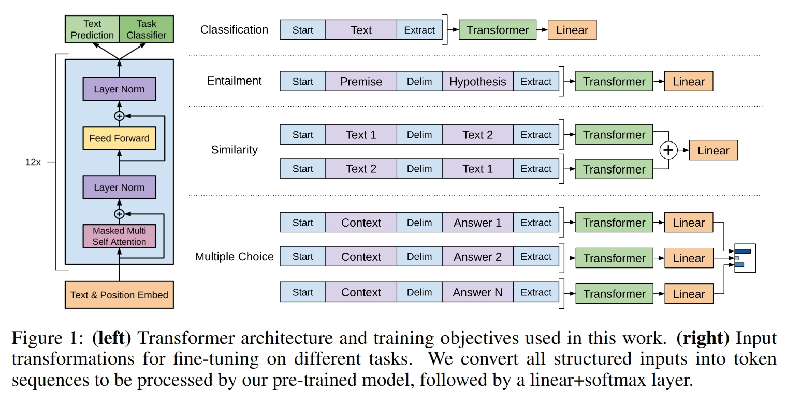

# GPT模型

GPT分为两个阶段:**无监督的生成式预训练**(Genetative Pre-trainning)和**有监督的下游任务微调**(fine-tuning)

## 模型结构

GPT是Decoder-Only的结构

> Delim:Delimter,定界符'\$'
>
> Startr:开始符,BOS
>
> Extract:结束符,EOS

与Transformer-Decoder不同的地方在于,只保留了Masked-MHA

## 无监督的预训练

​	训练数据会被分成一些不同的序列（sequence），每个**序列被看作是一个任务**，模型需要预测序列中下一个单词的概率分布。选取**交叉熵损失函数**

​	给定一个没有标注的大语料，记每一个序列为$U={u_1,…,u_n}$,GPT通过最大化以下释然函数来训练语言模型:
$$
L_{1}(U)=\sum_{i}logP(u_{i}|u_{k-i},...,u_{i-1};\Theta)
$$
其中，$k$表示上下文窗口的大小，这里计算每个单词的预测概率时，只考虑左侧窗口大小的词汇信息，在GPT中，作者采用的是一个12层的Transformer decoder作为语言模型的结构，其计算过程如下:
$$
h_{0} = UW_{e} + W_{p}
\\h_{l}=Transformer\_Block(h_{l-1})
\\P(u)=softmax(h_{n}W_{e}^T)
$$
其中,$U=(u_{k},...,u_{1})$表示左侧窗口的词向量, $n$为模型层数, $W_{e}$为词嵌入向量,$W_{p}$为Position Embedding,$P(u)$是对最后的预测结果softmax后得到进行tokenizer-decoder

> 下图为**Genarative**生成方式,这就是GPT中G的由来

## 有监督的微调

> 具体的方法可以查看上图，可以发现，对这些任务的微改主要是新增线性层的参数以及起始符、结束符和分隔符三种特殊符号的向量参数。

- **文本蕴涵：**对于文本蕴涵任务，作者用一个“\$”符号将文本和假设进行拼接，并在拼接后的文本前后加入开始符“start”和结束符“end”，然后将拼接后的文本直接传入预训练的语言模型，在模型再接一层linear层和softmax层即可。

- **文本相似度：**对于文本相似度任务，由于相似度不需要考虑两个句子的顺序关系，因此，为了反映这一点，作者将两个句子分别与另一个句子进行拼接，中间用“\$”进行隔开，并且前后还是加上起始和结束符，然后分别将拼接后的两个长句子传入Transformer，最后分别得到两个句子的向量表示$h_{l}^m$ ，将这两个向量进行元素相加，然后再linear层和softmax层。
- **问答和常识推理：**对于问答和常识推理任务，首先将背景信息与问题进行拼接，然后再将拼接后的文本依次与每个答案进行拼接，最后依次传入Transformer模型，最后接一层linear层和softmax层得到每个输入的预测值。

