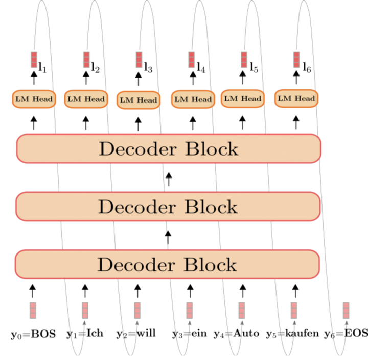
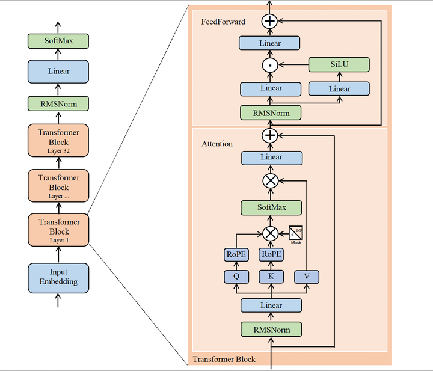
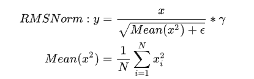
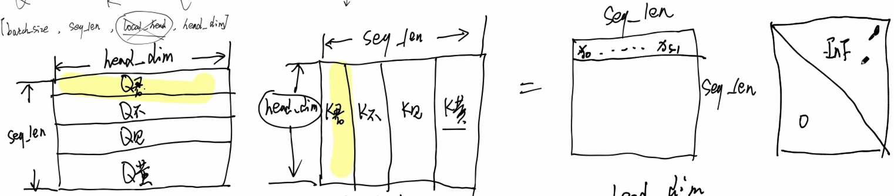

# LLAMA2

## bacis

**one-hot编码：**1，0编码，当词汇特别大时，不适用；另外one-hot编码方式忽略了词与词之间的空间特性

**embedding:**

```python
# 一般embedding在语言模型的最开始，也就是词token操作之后
# vocab_size 词汇表大小，hidden_size 隐藏层维度大小
word_embeddings= nn.Embedding(config.vocab_size, config.hidden_size, self.padding_idx)
# input_ids是句子分词后词id，比如上述的“我喜欢”可转换成为[0,1,2],数字是在词汇表【我，喜，欢，吃,面】中的索引，即token id
embeddings = word_embeddings(input_ids)  # embeddings的shape为[b,s,d],b:batch,s:seq_len,d:embedding size
```

## processing

### prompt

**Tokenization：**

- 将单词转化成Token序列

```python
from sentencepiece import SentencePieceProcessor
class Tokenizer:
    def __init__(self, model_path: str):
        # reload tokenizer
        self.sp_model=SentencePieceProcessor(model_file=model_path)
        # BOS / EOS token IDs
        self.bos_id: int = self.sp_model.bos_id() # 定义开始标识符
        self.eos_id: int = self.sp_model.eos_id() # 定义结束标识符

    def encode(self, s: str, bos: bool, eos: bool) -> List[int]:
        assert type(s) is str
        t = self.sp_model.encode(s)
        if bos:
            t = [self.bos_id] + t # 添加bos_id
        if eos:
            t = t + [self.eos_id] # 添加eos_id
        return t

'''
上述代码经过裁剪，并加入注解
这里用到"sentencepiece"库来对输入进行编码

OpenAi开源了编码方式：tiKtoten
''' 
```

**Embedding：**

- Token Embedding: 将Tokens映射到高维向量
- Positiong Embedding: 添加位置编码信息，目的是为模型提供上下文信息

### Generative

**自回归生成：**

- 利用自回归的方式，逐个生成输出序列的每个Token，前面生成内容作为上下文来帮助预测下一个Token

> 下图为Generative生成方式



**输出处理：**

- 自回归生成的Token序列通过一个输出层（Linear+Softmax），将每个位置的概率转化成对于Token的概率，选择概率最高的Token作为当前位置的输出

## Model

> Llama2是==decoder-only==结构
>
> Llama2将transformer中的LayerNorm换成了RMSNorm，MHA【Multi-Head Attention】换成了GQA【Grouped-query】（llama是MQA【Multi-query】）,postionnal换成了RotatyEmbedding（RoPE相对位置编码）
>
> 

### RMSNorm

RMSNorm(Root Mean Square Layer Normalization)是LayerNorm的变体，RMSNorm省去了求均值的过程，也没有了偏执β

作用：没有做re-center操作（移除了其中的均值项），简化计算量



> ε避免分母为0

### MASK

我们希望输入的前面字符不对后面字符有一个较高的注意力，因为在处理NLP时，前面的字应该不知道后面的字，后面的字是由前面的字推理出来的，所以做Mid = softmax(Q, K)时，需要对Mid做mask操作。



**softmax公式：**
$$
softmax(x_i) = \frac{e^{x_i}}{\sum^n_{i=0}e^{x_i}}
$$

### KV Cache

因为NLP任务中，当前位置字符的预测结果，与前面字符预测结果有关，所以我们希望不重复计算self-attention，而是将之前的结果依次缓存下来（这个缓存我们叫做kvc），将当前字符与前面所有字符计算的K 和 V缓存下来并添加到kvc， 这个过程叫做KV Cache。至于为什么不缓存Q，因为NLP是一个单向预测，不会重复用到”旧“Q。


### GQA

Llama-2 7B 没用到GQA，只有70B用了

出现原因：KV cache对存储单元大小要求高，对运算速度要求要。如果把KV数据存在显存（DRAM）里会导致读写速度慢，如果存在SRAM，那么内存又不够。所以要么提升硬件性能，要么优化软件。GQA就是软件优化算法。

我们使MHA仍然保持多组Q值，但分组共享K，V。这将会在模型的精度和计算效率之间做一个权衡。


### RoPE

Rotary Position Embedding的目的是：通过绝对位置编码的方式实现相对位置编码

### Feedback


$$
SiLu(x) = x*sigmoid(x)
$$
