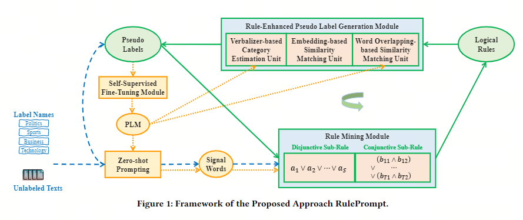
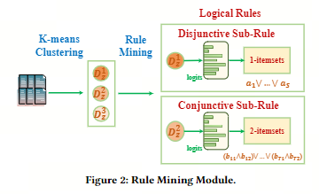
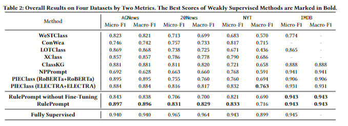

# RulePrompt

**paper：**[[2403.02932\] RulePrompt: Weakly Supervised Text Classification with Prompting PLMs and Self-Iterative Logical Rules (arxiv.org)](https://arxiv.org/abs/2403.02932)

**code：**[MiaomiaoLi2/RulePrompt (github.com)](https://github.com/MiaomiaoLi2/RulePrompt)

## 面向任务

**基于预训练与自训练的单标签弱监督平面文本分类**

针对弱监督文本分类任务，特别是零样本或无数据文本分类问题

## 问题

### 问题

逻辑规则很难手动设置为先验知识，但可以借助PLM生成的伪标签从初步分类的文本中挖掘出来。此外，挖掘出的规则和伪标签可以以另一种方式相互增强，以种子词为起点，建立知识获取和利用的自迭代闭环。这带来了两个主要挑战：（1）当不准确的伪标签可用时，如何使用PLM识别候选类别指示词，并通过逻辑规则在它们之间建立相关性来表征每个类别？（2） 对于不精确的逻辑规则，如何通过区别地处理每个逻辑运算符，将其有效地转换为PLM模板进行分类，然后更新分配给每个文本的伪标签？

### 解决方式

为了解决这些问题，本文首先以逻辑表达式的形式提出了一种新的基于规则的知识，用于WSTC中的类别理解。每个类别都由析取范式表示，其中指示词充当原子命题。具体来说，单个析取词（单词从句）表示强的、不言自明的指示词，而连接形式的从句则表示弱的、多义的指示词的协同效应

## 贡献

提出了一种基于逻辑表达式的规则知识形式，开发了一种名为RulePrompt的基于提示型PLM的方法，用于弱监督文本分类任务。该方法包括规则挖掘模块、规则增强的伪标签生成模块以及自监督微调模块，以使PLM与该任务保持一致。文章通过建立了一种自我迭代的知识获取和利用闭环，以种子词作为起点，有效地解决了弱监督文本分类任务中的挑战。这一贡献在实验中得到了验证，并明显优于最先进的弱监督方法。该方法还产生了可解释的类别规则，证明了在消除容易混淆的类别方面的优势。

## 具体做法

文章提出了一个基于提示PLM的新方法，用于WSTC任务。该方法包括三个关键模块：**规则挖掘模块（Rule Mining Module）**、**规则增强的伪标签生成模块(Rule-Enhanced Pseudo Label Generation
Module)**和**自监督微调模块(Self-Supervised Fine-Tuning Module)**。在规则挖掘模块中，基于当前具有置信度分数的伪标签，将未标记文本聚类为三组，并利用PLM获取每个文本的信号词，构成每个类别的逻辑规则的析取范式。在规则增强的伪标签生成模块中，将逻辑规则整合到三个基于提示PLM的分类模型中，以更新伪标签。最后，通过自监督微调模块，利用高置信度文本上的自监督损失来优化PLM以支持任务迭代。这一框架的设计旨在通过不断迭代伪标签和类别知识，实现WSTC任务的有效解决。

### 规则挖掘模块（Rule Mining Module）

规则挖掘模块主要包括三个步骤：

首先，通过K-means算法将被分配给某个类别𝑧的文本自适应聚类为三组，分别是具有高、中和低置信度的文本；

其次，对于文本的信号词，需要通过频繁模式挖掘来获取代表性的规则。对于置信度高的文本集合$𝐷^1_𝑧$和置信度中等的文本集合$𝐷^2_𝑧$，分别进行频繁1项集和2项集的挖掘，构建出**析取子规则(Disjunctive Sub-Rule)**和**合取子规则(Conjunctive Sub-Rule)**；

最后，需要对信号词进行过滤，确保它们作为指示性词的能力。这一过程旨在通过规则挖掘，进一步理解类别并丰富先验知识。整个过程的计算复杂度为$𝑂(𝑁^3) $

### 规则增强的伪标签生成模块(Rule-Enhanced Pseudo Label Generation Module)

规则增强的伪标签生成模块旨在将挖掘到的逻辑规则应用于伪标签生成过程，以提高分类准确性。该模块设计了三个单位来计算每个文本属于每个类别的概率，并通过这三个单位的输出结果进行平均得到最终结果。

**Verbalizer-based Category Estimation Unit**：利用逻辑规则中的指示词扩展语言模型中的动词，以帮助模型更好地理解文本主题。通过将逻辑规则中的指示词与PLM中的初始词嵌入相结合，计算每个文本属于每个类别的概率分布。

**Embedding-based Similarity Matching Unit**：通过计算文本和类别之间的嵌入式相似性来进行相似性匹配。对于逻辑规则中的每个类别，该单元将文本与类别之间的相似性计算为文本与类别中每个词的相似性加权和。

**Word Overlapping-based Similarity Matching Unit**：利用单词重叠的相似性匹配单元，通过在本地视图中检查单词重叠的相似性，利用PLMs生成信号词的能力。该单元将规则插入到输入文本的位置，而不是[MASK]标记中，作为独立的句子。对于包含强信号词的规则，计算强信号词的重叠，而对于包含较弱信号词的规则，匹配过程更为严格，将子规则分为两部分，分别构建句子，并取相似性分数的最大值。最终，文本和类别之间的单词重叠相似性定义为两个子规则的总和。

### 自监督微调模块(Self-Supervised Fine-Tuning Module)

该模块利用PLM当前的预测结果来微调PLM本身，逐渐使其适应特定任务。具体来说，采用自监督熵作为损失函数，用于提高PLM生成的类别分配的概率分布。这可以最大化PLM的潜力，并在模型训练过程中减少错误的积累和传播。由于伪标签的不准确性，我们只选择具有可接受预测概率的大多数文本（表示为$𝐷^{’}$​）进行微调。损失函数定义如下：
$$
L=\sum_{d\in D^{\prime}\subset D}\sum_{z\in Z}-P_{1}(z|d)\log P_{1}(z|d).
$$
其中，$𝑧$代表类别，而$𝑑$代表文本。

## 实验结果

与[survey](https://github.com/Jalen-Zhong/StudyNote4Jalen/blob/main/yzw%40program/Weakly-Supervised%20%20Text%20Classification/RulePrompt.md)中的方法做了对比

## 个人理解

与`survry`中的一些方法最大的不同地方在于，该文章用了强效规则来约束模型的自训练，这使模型不易发散。