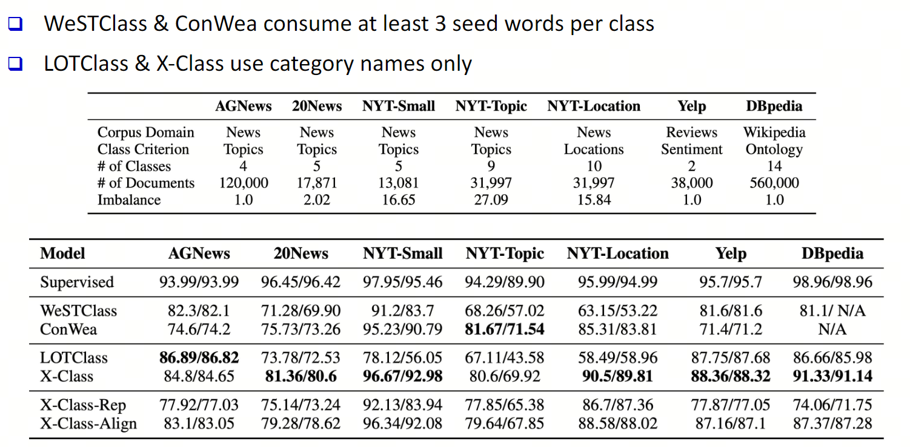
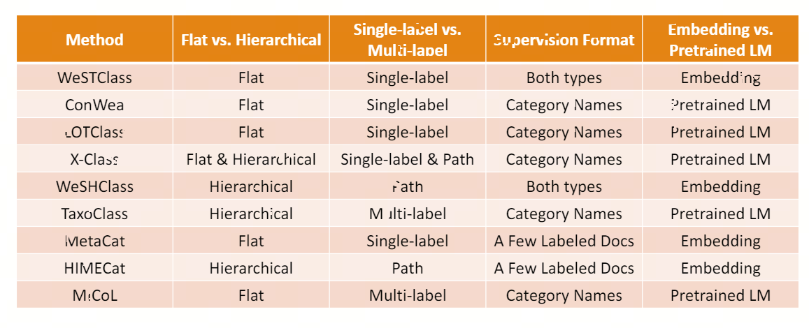

# Survey- [弱监督分类算法.pdf](..\..\..\..\hugedataorg\studystuff\无监督分类算法.pdf) 

## 弱监督文本分类

### 动机

​	人工标注成本高，专业领域数据获取困难。对于个人用户来说，其无法标注大量的数据，但可以提供：类别或类别相关关键字、少量的标注文档。这大大减少了模型训练成本。

### 解释

- 给定一组文本单元（例如，文档、句子）和一组类别，任务是将相关类别分配给每个文本单元
- 有如下下游任务：
  - 情绪分析、位置预测、新标题分类、文章标题分类、邮件意向标识、仇恨语言检测等

### 分类设置

- #### 单标签与多标签

- #### Flat & Hierarchical

​		Flat 将分本分为一个类（标签属于同一颗粒度级别）

​		Hierarchical将文本分为多个类（标签被组织到具有父子关系的层次结构）

### 定义

​	少量人工标注训练数据

#### 关键字级别弱监督

​	类别名称或一些相关关键字

#### 文档级别弱监督

​	一小组待标签的文档

### 总体思路

#### 联合表征学习

​	通过**embedding learning**或**预训练语言模型**将词（文档）、标签映射到高维空间

#### 伪数据生成

​	首先通过人工合成（LLM Model）或网络检索文档，再根据给定伪标签训练分类器

#### 预训练语言模型到分类任务的迁移

## 平面文本分类（Flat Text Classification）

这是一种传统的文本分类方法，将文本分类到单个类别或标签中。类别不是按层次结构组织的。例如，新闻文章的文本分类系统可能会将文章分类为“体育”、“政治”、“商业”或“技术”。

### Embedding方法 

#### WesTClass[[1]](#R1)

##### 方式

- 把所有词（包括标签、关键字）嵌入同一空间

- 通过关键字种子生成伪文档

- 伪文档（自带标签）做模型预训练，预训练权重加载无标签文档做自训练实现权重更新。

##### 模型

​	CNN+RNN

##### 其他

> Self-training是最简单的半监督方法之一，其主要思想是找到一种方法，用未标记的数据集来扩充已标记的数据集。算法流程如下：
>
> - 首先，利用已标记的数据来训练一个好的模型（教师模型）
>
> - 用学习到的模型预测未标记数据。
> - 将生成的伪标签与原始的标记数据相结合，并在合并后数据上进行训练生成模型（学生模型）。
> - 学生网络训练完成后变为教师模型再次训练下一个学生网络。
> - 整个过程可以重复n次，直到达到收敛。

### 预训练语言模型方法

#### 问题

- 预训练语言模型需要使用常识数据，且数据表征不能过于局部
- 同一个单词在上下文中的含义不同
- 人工标注成本高

#### Conwea[[2]](#R2)

- 根据单词的上下文自动区分单词的多种含义，创建上下文语料库
- 语料库用于迭代训练分类器并扩展种子词
- 上述过程添加新的种子词标签，并且消除种子词的语义歧义

#### LOTClass[[3]](#R3)

- 根据标签找到主题词
- 根据预训练`Bert`扩展主题词
- 模型自训练微调，设定阈值，认为当一个词的顶部替换词与主题词汇有足够的重叠时，才会将其视为“主题指示性”，避免语义歧义

#### X-Class[[4]](#R4)

- 同一语料库可根据分类任务的不同（情绪、主题等）分为不同的类别
- 根据类的聚类情况来分类，再不同的分类情况下训练分类器

### 总结

## 基于分类信息的文本分类（Text Classification with Taxonomy Information）

在这种方法中，使用称为分类法的分层结构对文本进行分类。分类法是一种层次分类系统，其中类别被组织成树状结构。例如，法律文件的文本分类系统可能会根据法律分类法对文件进行分类，如“刑法”、“民法”、“宪法”等。分类法信息可以帮助模型进行更细致、更精细的分类。

### Embedding方法

#### WeSHClass[[5]](#R5)

- 伪文档进行预训练，未标记文档进行自训练
- 多个局部分类器组合成全集分类器，贝叶斯估计来判断每个级别类的分类概率

### 预训练语言模型方法

#### TaxoClass [[6]](#R6)

- 计算文档类相似性：采用了一个预训练的文本蕴涵模型，该模型将文档作为“前提”，将类别名称填充到一个模板中作为“假设”，并输出这个前提能够蕴涵假设的概率，将这个概率作为文档-类别相似性的度量。
- 挖掘文档核心类：通过自顶向下的方法减少核心类的搜索空间，选择与文档最相似的类。其次是确定自信的核心类，通过观察文档与类之间的相似性以及从整体语料库的角度出发，识别文档的核心类。
- 训练分类增强分类器
- 通过多标签自训练泛化分类器

## 基于元数据信息的文本分类（Text Classification with Metadata Information）

在这种方法中，使用额外的元数据信息对文本进行分类。元数据是提供文本信息的数据，如作者、日期、来源等。元数据信息可以帮助模型进行更明智和上下文感知的分类。例如，社交媒体帖子的文本分类系统可以基于用户的人口统计、位置和社交网络对帖子进行分类。

### Embedding方法

#### MetaCat [[7]](#R7)

MetaCat利用元数据进行文本分类的方法是将文本和元数据嵌入到相同的语义空间中，以编码异构信号，并根据生成模型合成训练样本来解决标签稀缺的问题

#### HIMECat [[8]](#R8)

这是一个基于嵌入的生成框架，它集成了标签层次结构、元数据和文本信号，用于文档分类。主要贡献包括用于建模类别依赖关系、元数据信息和文本语义的新型联合表示学习模块，以及用于合成培训文档的数据增强模块。

### 预训练语言模型方法

#### MICoL[[9]](#R9)

利用文档元数据（如作者、地点和参考文献）来推导相似的文档对。通过训练分类器使用元数据计算文档和标签之间的相似性分数，MICoL 优于现有的零样本文本分类和对比学习方法

数据的输入是将文档和标签文本信息连接在一起，使用一个BERT模型进行编码，其中输入序列为“[CLS] 文档 [SEP] 标签 [SEP]”，然后通过在BERT之上添加一个线性层来获取文档和标签之间的相似度分数。数据的输出是通过微调Bi-Encoder和Cross-Encoder来改善它们的重新排序性能，采用对比学习框架，在没有带标签的文档的情况下，采用对比损失微调这两种架构。

## 总结

## 引用

[1] Meng Y, Shen J, Zhang C, et al. Weakly-supervised neural text classification[C]//proceedings of the 27th ACM International Conference on information and knowledge management. 2018: 983-992.

[2] Mekala D, Shang J. Contextualized weak supervision for text classification[C]//Proceedings of the 58th Annual Meeting of the Association for Computational Linguistics. 2020: 323-333.

    

[3] Meng Y, Zhang Y, Huang J, et al. Text classification using label names only: A language model self-training approach[J]. arXiv preprint arXiv:2010.07245, 2020.

    

[4] Aharoni R, Goldberg Y. Unsupervised domain clusters in pretrained language models[J]. arXiv preprint arXiv:2004.02105, 2020.

    

[5] Meng Y, Shen J, Zhang C, et al. Weakly-supervised hierarchical text classification[C]//Proceedings of the AAAI conference on artificial intelligence. 2019, 33(01): 6826-6833.

    

[6] Shen J, Qiu W, Meng Y, et al. TaxoClass: Hierarchical multi-label text classification using only class names[C]//NAAC'21: Proceedings of the 2021 Conference of the North American Chapter of the Association for Computational Linguistics: Human Language Technologies,{NAACL-HLT} 2021. 2021, 2021(1).

    

[7] Shen J, Qiu W, Meng Y, et al. TaxoClass: Hierarchical multi-label text classification using only class names[C]//NAAC'21: Proceedings of the 2021 Conference of the North American Chapter of the Association for Computational Linguistics: Human Language Technologies,{NAACL-HLT} 2021. 2021, 2021(1).

    

[8] Aharoni R, Goldberg Y. Unsupervised domain clusters in pretrained language models[J]. arXiv preprint arXiv:2004.02105, 2020.

    

[9] Zhang Y, Shen Z, Wu C H, et al. Metadata-induced contrastive learning for zero-shot multi-label text classification[C]//Proceedings of the ACM Web Conference 2022. 2022: 3162-3173.

    