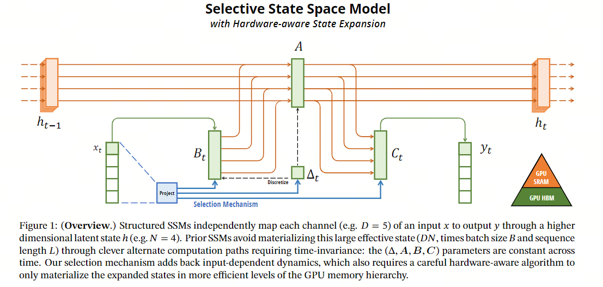
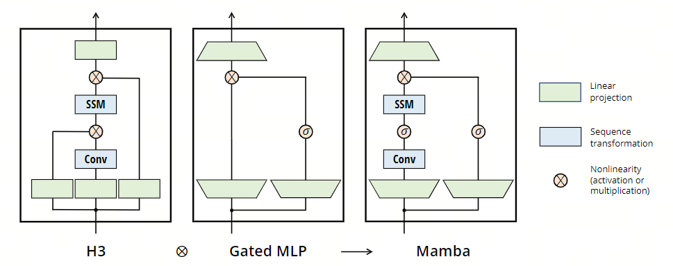
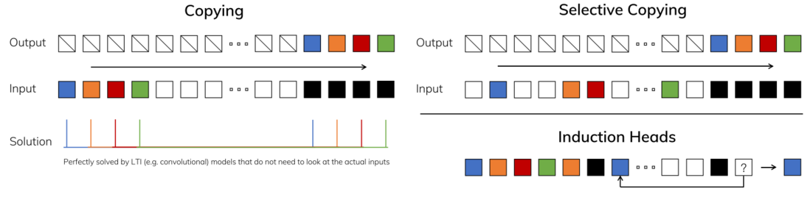
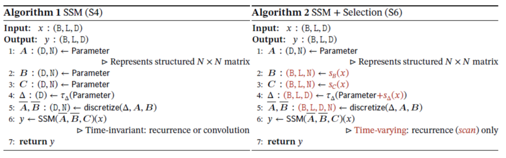
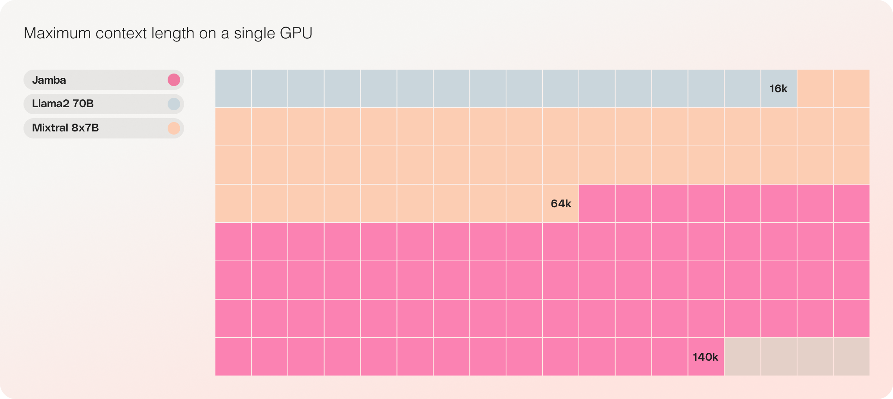

# manma模型

## 背景

首先是Transformer架构计算复杂度随序列长度增加呈二次方增长，这需要极大的计算资源开销。这种所谓的“长序列瓶颈”第一限制了其很难处理百万级别的长序列，第二增加了开发成本。

RWKV是一种基于线性注意力机制的新型架构，通过引入权重矩阵来近似Transformer的[自注意力机制](https://www.zhihu.com/search?q=自注意力机制&search_source=Entity&hybrid_search_source=Entity&hybrid_search_extra={"sourceType"%3A"answer"%2C"sourceId"%3A3472234717})，从而在保持模型性能的同时，显著减少了计算和内存需求。这种设计使得RWKV在处理长序列数据时，能够以更小的计算成本实现与Transformer相似的性能，特别是在语言建模等任务中。然而，RWKV在处理某些特定任务时，如稀疏奇偶校验等，仍然存在局限性。

Mamma是一种新型的选择性结构化状态空间模型（SSM），它通过引入选择性机制，能够在保持线性时间复杂度的同时，有效地处理长序列数据。这种设计不仅提高了模型的计算效率，还增强了其在信息密集型任务中的性能。

## 技术优势

- 线性时间复杂度：Mamba仍属于RNN范畴，具有线性复杂度。**另外需要说明的时，RNN类的模型在反向传播过程中极慢，需要CUDA加速（源项目中有提供）**
- 选择机制：这种机制允许模型根据当前输入动态地调整其状态，从而在序列中选择性地保留或忽略信息
- 硬件感知设计：Mamba的并行算法充分利用了现代GPU的内存层次结构，通过在不同的内存级别之间高效地移动数据，减少了不必要的内存访问和数据传输

## 模型架构

SSM

mamma

## 细节

### 结构化状态空间序列模型（S4）

结构化状态空间序列模型（Structured State Space Sequence Models，简称S4）是一种新兴的深度学习序列模型，它与循环神经网络（RNNs）、卷积神经网络（CNNs）及经典的状态空间模型相关联。这些模型受到了一种将一维函数或序列映射到另一个一维函数或序列通过隐式潜在状态的特定连续系统的启发。

具体来说，S4模型使用四个参数（$\Delta,A$, $B$, $C$）定义序列到序列的转换过程，分为两个阶段：

第一阶段（离散化）：将“连续参数”（$\Delta,A$, $B$）转换为“离散参数”（$\bar{A}$, $\bar{B}$）。

第二阶段：通过离散化后的参数计算序列转换，可以通过线性递归或全局卷积两种方式实现

##### S4模型 核心公式

首先描述S4模型的核心动态，即如何从一个时间步骤到下一个时间步骤更新潜在状态，并如何从这个潜在状态生成输出序列：
公式(1a): $h'(t) = A h(t-1) + B x(t)$

这个公式描述了潜在状态$h(t)$的更新规则，其中$A$是状态转换矩阵，$B$是输入到状态的转换矩阵，$x(t)$是当前时间步的输入。这表明当前的潜在状态是由前一个时间步的潜在状态和当前输入的组合决定的。

公式(1b): $y(t) = C h(t)$

这个公式描述了如何从潜在状态$h(t)$生成输出$y(t)$，其中$C$是状态到输出的转换矩阵。这表明输出直接依赖于当前的潜在状态。

进一步，作者提供这两个公式(1a)和(1b)的另一种表示形式，强调了模型的递归特性：

公式(2a): $h_t = \bar{A} h_{t-1} + \bar{B} x_t$

这是对(1a)的简化表示，强调了潜在状态是通过递归方式更新的，其中$h_{t-1}$代表前一时间步的潜在状态。

公式(2b): $y_t = C h_t$

这是对(1b)的简化表示，说明了输出$y_t$是当前潜在状态$h_t$的直接函数。

以下两个公式提供了通过全局卷积实现序列到序列转换的视角：

公式(3a): $\bar{K} = (C\bar{B}, C\bar{AB}, \ldots, C\bar{A}^{k}\bar{B}, \ldots)$

公式(3b): $y = x \ast \bar{K}$

公式(3a)和(3b) 展示了如何通过状态空间模型将输入转换成输出。公式(3a)描述了通过状态转换矩阵$\bar{A}$对输入矩阵$\bar{B}$的连续应用，结合输出矩阵$C$，构造出核$\bar{K}$。这个过程有效地建立了一系列应用于输入的转换。公式(3b)展示了输入$x$与核$K$的卷积，说明了如何综合变换后的输入产生输出$y$。这种公式化的目的是为了模拟动态系统在将输入转换为输出时的行为，捕捉时间依赖性和系统参数对输出的影响。

##### 离散化

首先将“连续参数”（$∆$、$A$、$B$）转换为“离散参数”（$\bar{A}$、$\bar{B}$）的过程，这一转换通过固定的公式完成，例如通过零阶保持（ZOH）规则，可以得到：
$[A = e^{\Delta A}, \quad B = (\Delta A)^{-1}(e^{\Delta A} - I) \cdot \Delta B]$

这种离散化与连续时间系统有深刻的联系，它为模型赋予了额外的属性，如分辨率不变性和自动的模型正则化等。此外，它还与RNNs的门控机制有关，但从机械角度来看，离散化可以简单视为SSM在前向传播中的计算图的第一步。

##### 计算

参数从（$∆$、$A$、$B$、$C$）转换为（$\bar{A}$、$\bar{B}$、$C$）后，模型可以以两种方式计算：线性递归或全局卷积。模型通常在训练时使用卷积模式（以便于并行化处理），在自回归推理时切换到递归模式（逐时间步处理输入）。

##### 线性时间不变性（LTI）

这些方程的一个重要属性是模型的动态性质在时间上是恒定的，即$∆$、$A$、$B$、$C$（包括$\bar{A}$、$\bar{B}$）对所有时间步都是固定的。这种性质称为线性时间不变性，与递归和卷积深度相关联。从直观上讲，LTI SSMs等价于任何线性递归或卷积，并使用LTI作为这些模型类别的统称。

然而，所有的结构化SSMs都是LTI的，即通过卷积计算，这是由于基本的效率约束。但本介绍的工作的一个核心洞见是，LTI模型在模拟某些类型的数据时存在根本性限制，作者的技术贡献包括在克服效率瓶颈的同时移除LTI约束。

##### 结构和维度

高效计算结构化SSMs也需要对$A$矩阵施加结构，最常见的结构形式是对角线。在这种情况下，$A \in \mathbb{R}^{N \times N}, \quad B \in \mathbb{R}^{N \times 1}, \quad C \in \mathbb{R}^{l \times N}
$​矩阵可以用数字表示。为了处理具有通道数的输入序列，SSM独立应用于每个通道。在这种情况下，总的隐藏状态具有每个输入的维度，其计算跨序列长度需要的时间和内存是效率瓶颈的根源。

## Selective State Space Models

文中进一步提出一种改进的状态空间模型（SSM），这种模型通过引入选择机制来增强其对输入序列的处理能力。这个选择机制可能允许模型根据输入的相关性来动态调整其关注点，从而提高处理长序列数据的效率和准确性。

上图描述了几个不同的任务，用于展示时间不变模型如线性递归和全局卷积的局限性，以及选择性模型在处理这些限制方面的优势。这些任务包括：

标准复制任务（左图）：这个任务在输入和输出元素之间有恒定的间距，可以通过时间不变模型，如线性递归和全局卷积轻松解决。
选择性复制任务（右上图）：这个任务在输入之间有随机间距，需要时间变化模型能够根据内容选择性地记住或忽略输入。
归纳头任务（右下图)：这是一种基于上下文检索答案的关联回忆示例，对于大型语言模型来说是一个关键能力。

从中可以发现在设计序列模型时，引入能够根据输入序列的内容和上下文进行动态调整的机制的重要性。这种机制不仅提高了模型在处理复杂序列时的灵活性和效率，而且对于提升模型在执行基于上下文的高级认知任务方面的能力也是至关重要的。

算法1和算法2展示了作者使用的主要选择机制。它们的关键区别在于，使得一些参数（$\Delta$, $B$, $C$）成为输入的函数，并伴随整个过程中张量形状的相关变化。具体而言，这些参数现在具有长度维度，意味着模型从时间不变（time-invariant）变为时间变化（time-varying）。这一变化失去了与卷积（公式3）的等效性，对其效率有所影响。

算法1（SSM（S4））：展示了一个结构化的状态空间模型（SSM）的构建过程，它不包括选择机制。这是一个时间不变模型，可以通过递归或卷积的方式实现。
算法2（SSM + 选择（S6））：在算法1的基础上添加了选择机制，通过使$\Delta$, $B$, $C$成为输入的函数，引入了时间变化特性。这种机制允许模型根据输入动态调整其行为，使其能够更灵活地处理复杂序列数据。

通过引入选择机制，算法2能够针对每个时间步的特定输入调整模型参数，从而使模型能够根据上下文内容进行适应性变化。这种时间变化的特性使得模型能够在序列建模中更有效地压缩上下文信息，提高了处理长序列和复杂依赖关系的能力。

## 个人理解

- Transformer理论上是$O(n)^2$​的计算复杂度，但其能够并行训练，所以训练快，推理慢。RNN类网络是线性复杂度，但无法并行训练，所以训练慢，推理快。Mamba的优势在于能够并行训练，且是线性复杂度。

- 目前Mamba模型在语音、视频上表现比较出色，这可能源自于RNN类网络天生对序列数据敏感。
- Mamba模型于2023年12月发布，目前基于Mamba的LLM仅有Jamba，未来Mamba框架如何还需要待各个大厂去实验，这需要时间和成本。

## 参考

细节过程，值得参考：[Mamba详细介绍和RNN、Transformer的架构可视化对比](https://segmentfault.com/a/1190000044651406?utm_source=sf-similar-article)

# Jamba模型

## 背景

基于Mamba-Transformer混合架构开发的LLM

## 模型

## 优势

部分任务表现更优：

更大的吞吐量：

