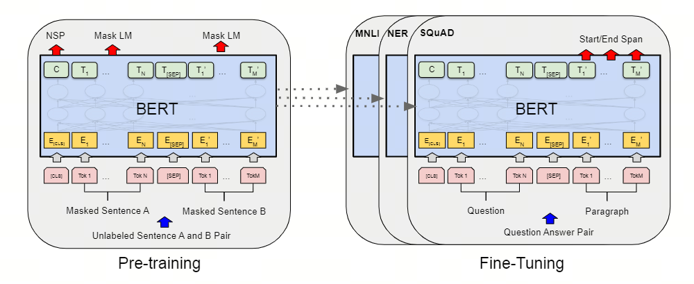

# 特点 

1. 双向预训练：通过随机mask或随机替换句子中的单词，仅让模型预测被mask或被替换的单词。该过程成为`masked LM`。且可以实现句子的双向预训练。
2. 无监督预训练：不需要标注数据，节省成本。其原理是基于自然语言的连贯性，语言模型根据前文的词，预测下一个将出现的词。如果语言模型的参数正确，如果每个词的词向量设置正确，那么语言模型的预测，就应该比较准确。
3. 模型架构基于transformer，深而窄。

# 问题

1. 预训练和finetuning之间不匹配，因为在finetuning期间从未看到[MASK]token。解决：不总是mask掉句子中的单词，而是少许的时间下替换该单词或保持单词不变，这样能让`encoder`不知道它将被要求预测哪些单词或哪些单词已被随机单词替换，因此它被迫保持每个输入token的分布式上下文表示。
2. 每个batch只预测了15％的token（因为是被随机mask掉，而不是类似于`left-to-right`去预测每一个单词），这表明模型可能需要更多的预训练步骤才能收敛。训练速度略慢于`left-to-right`。

# 其他

## BERT输入表示

输入嵌入是token embeddings, segmentation embeddings 和position embeddings 的总和

## 模型训练微调综述

## 项目地址

[google-research/bert: TensorFlow code and pre-trained models for BERT (github.com)](https://github.com/google-research/bert?tab=readme-ov-file)

# 个人理解

`Bert`与`GPT`在预训练阶段的主要区别在于一个是双向一个是单向。

在`nano-GPT`的项目中，当前单词的预测结果取决于该单词前面所有单词。而`Bert`通过随机mask单词实现了双向预测，单词的预测结果来源于上下文信息而不仅仅局限于上文信息了。

`nano-GPT`的任务在于给定一个关键词和最长tokens，来让模型根据关键词续写句子。在`GPT`和`Bert`的任务通常是通过上文句子预测下文句子，他们都是通过特殊字符[CLS]来实现对句子的分段，以实现无监督预训练。

# 参考

[[1810.04805\] BERT: Pre-training of Deep Bidirectional Transformers for Language Understanding (arxiv.org)](https://arxiv.org/abs/1810.04805)

[NLP必读：十分钟读懂谷歌BERT模型 - 知乎 (zhihu.com)](https://zhuanlan.zhihu.com/p/51413773)

[google-research/bert: TensorFlow code and pre-trained models for BERT (github.com)](https://github.com/google-research/bert?tab=readme-ov-file)